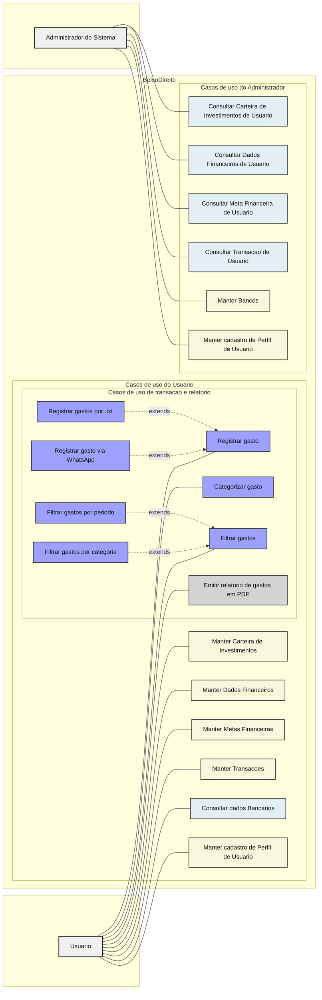

# Diagrama de Casos de Uso - BolsoDireito

```mermaid
flowchart LR
  %% Coluna esquerda
  subgraph LEFT[" "]
    direction TB
    U["Usuario"]
  end

  %% Fronteira do sistema
  subgraph SYS["BolsoDireito"]
    direction LR

    subgraph USERAREA["Casos de uso do Usuario"]
      direction TB
      UCI["Manter Carteira de Investimentos"]
      UDF["Manter Dados Financeiros"]
      UMF["Manter Metas Financeiras"]
      UTR["Manter Transacoes"]
      UBC["Consultar dados Bancarios"]
      UPU["Manter cadastro de Perfil de Usuario"]

      subgraph DET["Casos de uso de transacao e relatorio"]
        direction TB
        REGM["Registrar gasto"]
        REGW["Registrar gasto via WhatsApp"]
        REGT["Registrar gastos por .txt"]
        CATG["Categorizar gasto"]
        FILT["Filtrar gastos"]
        FILC["Filtrar gastos por categoria"]
        FILP["Filtrar gastos por periodo"]
        RPDF["Emitir relatorio de gastos em PDF"]
      end
    end

    subgraph ADMINAREA["Casos de uso do Administrador"]
      direction TB
      ACI["Consultar Carteira de Investimentos de Usuario"]
      ADF["Consultar Dados Financeiros de Usuario"]
      AMF["Consultar Meta Financeira de Usuario"]
      ATR["Consultar Transacao de Usuario"]
      ABC["Manter Bancos"]
      APU["Manter cadastro de Perfil de Usuario"]
    end
  end

  %% Coluna direita
  subgraph RIGHT[" "]
    direction TB
    A["Administrador do Sistema"]
  end

  %% Associacoes principais
  U --- UCI
  U --- UDF
  U --- UMF
  U --- UTR
  U --- UBC
  U --- UPU

  A --- ACI
  A --- ADF
  A --- AMF
  A --- ATR
  A --- ABC
  A --- APU

  %% Casos detalhados do usuario
  U --- REGM
  U --- CATG
  U --- FILT
  U --- RPDF

  REGW -.->|extends| REGM
  REGT -.->|extends| REGM

  FILC -.->|extends| FILT
  FILP -.->|extends| FILT

  %% Estilo
  classDef papeisUsuario fill:#f0f0f0,stroke:#222,stroke-width:2px,color:#111;
  classDef crud fill:#f8f8dc,stroke:#222,stroke-width:1.5px,color:#111;
  classDef consulta fill:#e3eef5,stroke:#222,stroke-width:1.5px,color:#111;
  classDef transacao fill:#9ea0ff,stroke:#222,stroke-width:1.5px,color:#111;
  classDef relatorio fill:#d3d3d3,stroke:#222,stroke-width:1.5px,color:#111;
  classDef invisivel fill:transparent,stroke:transparent,color:transparent;

  class U,A papeisUsuario;
  class UCI,UDF,UMF,UTR,UPU,ABC,APU crud;
  class UBC,ACI,ADF,AMF,ATR consulta;
  class REGM,REGW,REGT,CATG,FILT,FILC,FILP transacao;
  class RPDF relatorio;
```
