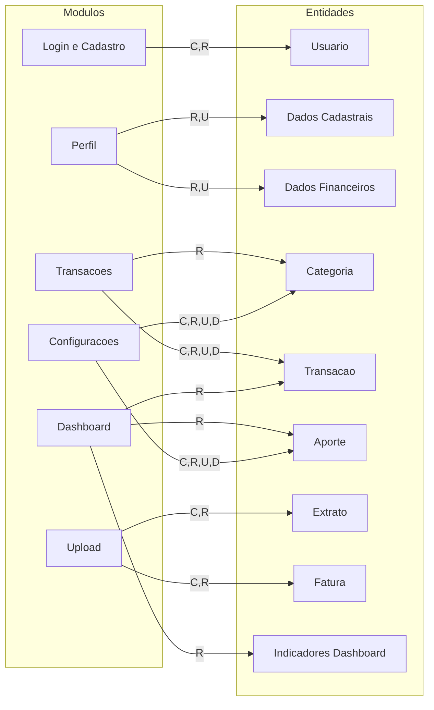

# Matriz CRUD - BolsoDireito

Abaixo, a matriz CRUD representada em Mermaid no formato de grafo (modulos -> entidades).

## Legenda

- C: Create (Criar)
- R: Read (Ler)
- U: Update (Atualizar)
- D: Delete (Excluir)

## Observacao

Se quiser, posso transformar esta versao em uma matriz tabular estrita (linhas x colunas) e separar por contexto, por exemplo:

- Matriz de paginas x entidades
- Matriz de APIs backend x entidades
- Matriz de componentes frontend x entidades
