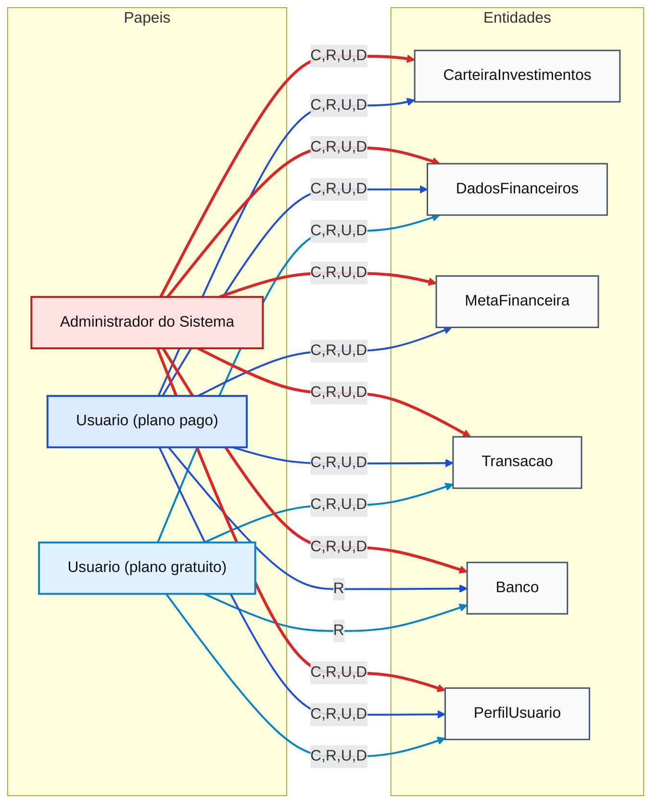

# Matriz CRUD - BolsoDireito

## Matriz CRUD (versão 1) - Permissoes (Papeis x Entidades)

| Papel de usuario | CarteiraInvestimentos | DadosFinanceiros | MetaFinanceira | Transacao | Banco | PerfilUsuario |
| --- | --- | --- | --- | --- | --- | --- |
| Usuario (plano gratuito) | - | Create, Read, Update, Delete | - | Create, Read, Update, Delete | Read | Create, Read, Update, Delete |
| Usuario (plano pago) | Create, Read, Update, Delete | Create, Read, Update, Delete | Create, Read, Update, Delete | Create, Read, Update, Delete | Read | Create, Read, Update, Delete |
| Administrador do Sistema | Create, Read, Update, Delete | Create, Read, Update, Delete | Create, Read, Update, Delete | Create, Read, Update, Delete | Create, Read, Update, Delete | Create, Read, Update, Delete |

## Representacao em Mermaid - Matriz CRUD (versão 1)

## Legenda

- C: Create (Criar)
- R: Read (Ler)
- U: Update (Atualizar)
- D: Delete (Excluir)
- Azul claro: permissoes do Usuario (plano gratuito)
- Azul escuro: permissoes do Usuario (plano pago)
- Vermelho: permissoes do Administrador do Sistema

## Matriz CRUD (versão 2) - Entidades vs Funcionalidades

| Entidades / Funcionalidades | Manter cadastro de Perfil de Usuario | Gerenciar Perfis de Usuario | Registrar gasto | Categorizar gasto | Filtrar gastos | Emitir relatorio de gastos | Manter Carteira de Investimentos | Manter Metas Financeiras | Manter Transacoes | Consultar dados Bancarios | Emitir dashboard de gastos | Gerenciar Carteira de Investimentos dos Usuarios | Gerenciar Dados Financeiros dos Usuarios | Gerenciar Metas Financeiras dos Usuarios | Gerenciar Transacoes dos Usuarios | Manter Bancos |
| --- | --- | --- | --- | --- | --- | --- | --- | --- | --- | --- | --- | --- | --- | --- | --- | --- |
| CarteiraInvestimentos | - | - | - | - | - | - | Create, Read, Update, Delete | - | - | - | - | - | - | - | - | - |
| DadosFinanceiros | - | - | - | - | - | - | - | - | - | - | - | Read, Delete | Read | Read, Delete | Read | - |
| MetaFinanceira | - | - | - | - | - | - | - | Create | - | - | - | Create, Read, Update, Delete | - | - | - | - |
| Transacao | - | Read | Create | Update | Read | Read | - | - | Create, Read, Update, Delete | - | Read, Create | Create, Read, Update, Delete | - | - | Create, Read, Update, Delete | - |
| Banco | - | - | - | - | - | - | - | - | - | Read | - | - | - | - | - | Create, Read, Update, Delete |
| PerfilUsuario | Create, Read, Update, Delete | Read, Delete | - | - | - | - | - | - | - | - | - | - | - | - | - | - |
